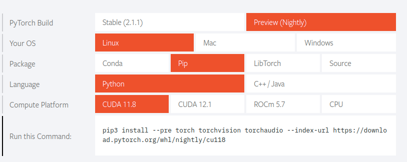

# NOTE

## 运行报错

```
torch.onnx.errors.UnsupportedOperatorError: Exporting the operator 'aten::unflatten' to ONNX opset version 14 is not supported. Please feel free to request support or submit a pull request on PyTorch GitHub: https://github.com/pytorch/pytorch/issues.
```

错误原始是缺少算子：aten::unflatten

## 参考解决方案

### 升级pytorch-nightly版本



### 增加算子

在`/torch/onnx/symbolic_opset13.py`添加如下代码:

```python
# Ported from
# https://github.com/microsoft/onnxscript/blob/6b1b81700b4523f31d8c6d3321e5d8ef5d42b764/onnxscript/function_libs/torch_aten/ops/core.py#L6097
# NOTE: Supporting aten::unflatten before opset13 needs helper function to adjust ONNX op changes in Concat, Slice, ...
@_onnx_symbolic("aten::unflatten")
@_beartype.beartype
def unflatten(g: jit_utils.GraphContext, input, dim, unflattened_size):
    input_dim = symbolic_helper._get_tensor_rank(input)
    if input_dim is None:
        return symbolic_helper._unimplemented(
            "dim",
            "ONNX and PyTorch use different strategies to split the input. "
            "Input rank must be known at export time.",
        )

    # dim could be negative
    input_dim = g.op("Constant", value_t=torch.tensor([input_dim], dtype=torch.int64))
    dim = g.op("Add", input_dim, dim)
    dim = g.op("Mod", dim, input_dim)

    input_size = g.op("Shape", input)

    head_start_idx = g.op("Constant", value_t=torch.tensor([0], dtype=torch.int64))
    head_end_idx = g.op(
        "Reshape", dim, g.op("Constant", value_t=torch.tensor([1], dtype=torch.int64))
    )
    head_part_rank = g.op("Slice", input_size, head_start_idx, head_end_idx)

    dim_plus_one = g.op(
        "Add", dim, g.op("Constant", value_t=torch.tensor([1], dtype=torch.int64))
    )
    tail_start_idx = g.op(
        "Reshape",
        dim_plus_one,
        g.op("Constant", value_t=torch.tensor([1], dtype=torch.int64)),
    )
    tail_end_idx = g.op(
        "Constant", value_t=torch.tensor([_constants.INT64_MAX], dtype=torch.int64)
    )
    tail_part_rank = g.op("Slice", input_size, tail_start_idx, tail_end_idx)

    final_shape = g.op(
        "Concat", head_part_rank, unflattened_size, tail_part_rank, axis_i=0
    )

    return symbolic_helper._reshape_helper(g, input, final_shape)
```

**上述代码就是升级nightly版本后在OP13里面多出来的部分。**

同样的，可以不在`/torch/onnx/symbolic_opset13.py`中修改。

直接在`export-transfuser.py`中增加如下代码，会得到同样的结果

```python
# Ported from
# https://github.com/microsoft/onnxscript/blob/6b1b81700b4523f31d8c6d3321e5d8ef5d42b764/onnxscript/function_libs/torch_aten/ops/core.py#L6097
# NOTE: Supporting aten::unflatten before opset13 needs helper function to adjust ONNX op changes in Concat, Slice, ...

def unflatten(g, input, dim, unflattened_size):
    
    input_dim = torch.onnx.symbolic_helper._get_tensor_rank(input)
    
    # dim could be negative
    input_dim = g.op("Constant", value_t=torch.tensor([input_dim], dtype=torch.int64))
    dim = g.op("Add", input_dim, dim)
    dim = g.op("Mod", dim, input_dim)

    input_size = g.op("Shape", input)

    head_start_idx = g.op("Constant", value_t=torch.tensor([0], dtype=torch.int64))
    head_end_idx = g.op(
        "Reshape", dim, g.op("Constant", value_t=torch.tensor([1], dtype=torch.int64))
    )
    head_part_rank = g.op("Slice", input_size, head_start_idx, head_end_idx)

    dim_plus_one = g.op(
        "Add", dim, g.op("Constant", value_t=torch.tensor([1], dtype=torch.int64))
    )
    tail_start_idx = g.op(
        "Reshape",
        dim_plus_one,
        g.op("Constant", value_t=torch.tensor([1], dtype=torch.int64)),
    )
    tail_end_idx = g.op(
        "Constant", value_t=torch.tensor([9223372036854775807], dtype=torch.int64)
    )
    tail_part_rank = g.op("Slice", input_size, tail_start_idx, tail_end_idx)

    final_shape = g.op(
        "Concat", head_part_rank, unflattened_size, tail_part_rank, axis_i=0
    )

    return torch.onnx.symbolic_helper._reshape_helper(g, input, final_shape)

torch.onnx.register_custom_op_symbolic(
    symbolic_name="aten::unflatten",
    symbolic_fn=unflatten,
    opset_version=14,
)

```